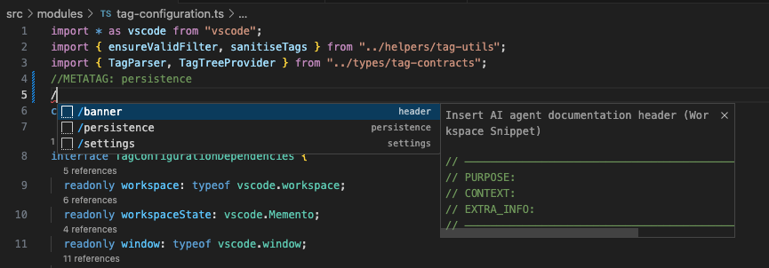
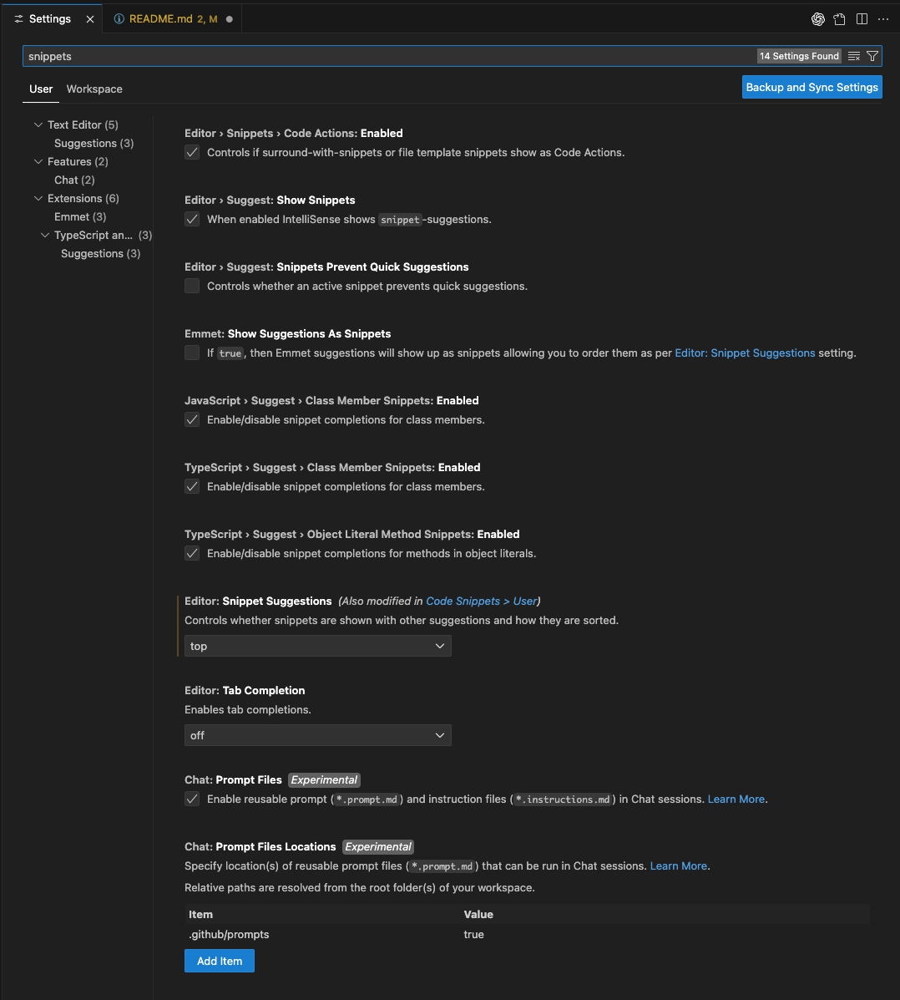
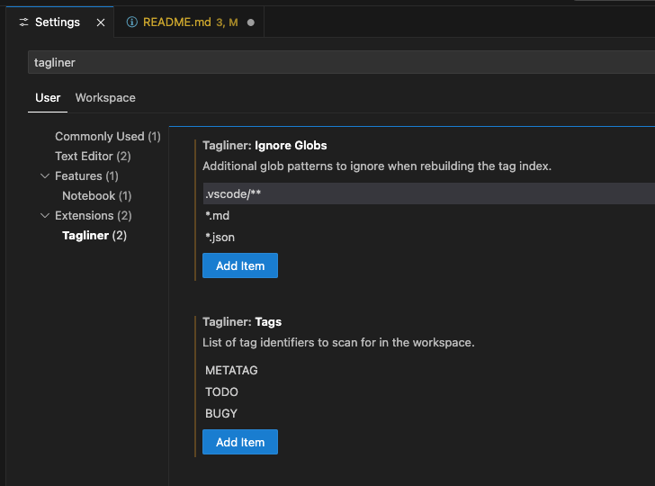

# Tagliner

Tagliner helps feature notes and TODOs from getting lost in larger projects. It designed to save `METATAG: quoteService` or `TODO: billing` directly in files and Tagliner maintains tags map in realtime!


## Why use Tagliner?

- **Instant signal** – watches files as you save changes and keeps the tag index updated in a persistent storage, so the sidebar stays in sync even across reloads. Other extentions require periodic scans.
- **Purpose-built tree** – your tags (METATAG, TODO, BUG, or anything you configure) show up grouped by value with direct jumps to the exact line. Other extentions always group tags by file: which defeats the purpose of using metadata!
- **Smart ignore rules** – extention respects VS Code excludes, your custom glob list, and every `.gitignore` (nested ones too) before it performs scan
- **Manual rebuild on tap** – manually trigger a full rescan when you need it; the index stays lean the rest of the time

## Configuration

Set the list of tags to track via `Settings → Extensions → Tagliner`: update the `tagliner.tags` array (default is `METATAG`, `TODO`, `BUG`). The first entry becomes the default view filter and you can switch tags at any time from the Tagliner view menu.

Use `tagliner.ignoreGlobs` to add any additional glob patterns (default `.vscode/**`) that should be skipped during a rebuild on top of workspace `files.exclude`, `search.exclude`, and `.gitignore` rules.

For fast tagging, use VS Code snippets. In the command pallet, select "Configure Snippets", add snippet file. Here's a sample to get started:

```
{
  "persistence": {
    "scope": "javascript,typescript",
    "prefix": "/persistence",
    "body": ["//METATAG: persistence"]
  },
  "settings": {
    "scope": "javascript,typescript",
    "prefix": "/settings",
    "body": ["//METATAG: ui"]
  },
  "header": {
    "scope": "javascript,typescript",
    "prefix": "/banner",
    "body": [
      "// ──────────────────────────────────────────────────────────────",
      "// PURPOSE: $1",
      "// CONTEXT: $2",
      "// EXTRA_INFO: $3",
      "// ──────────────────────────────────────────────────────────────"
    ],
    "description": "Insert AI agent documentation header"
  }
}

```

When you start typing in the editor /setti - it will show snippents list.


Settings for snippets to show them on top of Intellisense list:



Finally, settings of the extention:



## Tagliner in Commands Pallete

- `Tagliner: Select Tag Filter` — choose which tag the tree should display.
- `Tagliner: Rebuild Tag Index` — rescan the entire workspace when you need to refresh the index.

## Getting Started

1. Add a tag to any file, e.g. `METATAG: quoteService` or `TODO: onboarding`.
2. Pop open the Tagliner Activity Bar view — your tag appears instantly, grouped by value.
3. Click the file entry to land with the cursor on the tagged line, ready to ship the change.

## Requirements

No additional tooling is required beyond VS Code 1.104 or newer.

## Release Notes

### 0.0.4

- Update storeage version to prevent bypass of git ignore patterns.

### 0.0.3

- Initial preview with automatic tag indexing, Activity Bar view, rebuild command, and configurable tag list.

### 0.0.2

- Bugfixes and improvements.

### 0.0.1

- Initial idea and testing prototype

---

Tagliner is built for teams who track features, TODOs, and refactors directly in their codebase—and expect that context to be one click away.
